# Driving behavior cloning

[](LICENSE)[](https://www.codacy.com/manual/frgfm/sdcnd-p4-behavioral-cloning?utm_source=github.com&amp;utm_medium=referral&amp;utm_content=frgfm/sdcnd-p4-behavioral-cloning&amp;utm_campaign=Badge_Grade) [](https://circleci.com/gh/frgfm/sdcnd-p4-behavioral-cloning) [](https://codecov.io/gh/frgfm/sdcnd-p4-behavioral-cloning)

This repository is an implementation of a simulated driving behavior for the behavioral cloning project of Udacity Self-Driving Car Nanodegree (cf. [repo](<https://github.com/udacity/CarND-Behavioral-Cloning-P3>)).


<p align="center">
  
</p>


## Table of Contents

- [Getting Started](#getting-started)
  - [Prerequisites](#prerequisites)
  - [Installation](#installation)
- [Usage](#usage)
- [Approach](#Approach)
- [Credits](#credits)
- [License](#license)


## Getting started

### Prerequisites

- Python 3.6 (or more recent)
- [pip](https://pip.pypa.io/en/stable/)
- [Unity3D](https://unity3d.com/get-unity/download)

### Installation

#### Python

You can install the project requirements as follows:

```shell
git clone https://github.com/frgfm/sdcnd-p4-behavioral-cloning.git
cd sdcnd-p4-behavioral-cloning
pip install -r requirements.txt
```

If you do not plan on collecting data yourself, feel free to use the sample driving [data](https://d17h27t6h515a5.cloudfront.net/topher/2016/December/584f6edd_data/data.zip) provided by Udacity. Extract it in the repo folder to obtain a folder hierarchy as follows:

```
.
├── data
│   ├── driving_log.csv
│   ├── IMG
├── LICENSE
├── README.md
├── requirements.txt
├── src
│   ├── dataset.py
│   ├── drive.py
│   ├── models.py
│   ├── train.py
│   └── video.py
├── static
│   └── images
└── test
    ├── test_dataset.py
    └── test_models.py
```


If you wish to collect your own training data, run your environment build, select a track and click on  `Training mode`. Press the `R` key to choose an output folder (`./data` is much recommended to be able to use default script arguments). Now you can play with the environment, just press `R` again to start your recording, and `R` again to stop it.

You can download the trained [model](https://github.com/frgfm/sdcnd-p4-behavioral-cloning/releases/download/v0.1.0/model.h5) (put the checkpoint in the `./data` folder).

*Note: if you wish to use CPU only, replace the `tensorflow-gpu` dependencies with `tensorflow`*


#### Unity

After installing Unity3D, you will need an environment build to run the simulation. Download the appropriate build for your OS and extract it:

- [Linux](https://s3-us-west-1.amazonaws.com/udacity-selfdrivingcar/Term1-Sim/term1-simulator-linux.zip)
- [Mac](https://s3-us-west-1.amazonaws.com/udacity-selfdrivingcar/Term1-Sim/term1-simulator-mac.zip)
- [Windows](https://s3-us-west-1.amazonaws.com/udacity-selfdrivingcar/Term1-Sim/term1-simulator-windows.zip)

If you encounter an issue with the above builds, please refer to the "Available Game Builds" section of this [readme](https://github.com/udacity/self-driving-car-sim).


## Usage

### Training

A training script is available to train the steering angle regressor on the training dataset.

```
usage: train.py [-h] [--arch ARCH] [--folder FOLDER] [--batch-size BATCH_SIZE]
                [--lr LR] [--size SIZE] [--output OUTPUT]
                [--correction CORRECTION] [--dropout DROPOUT]
                [--resampling RESAMPLING]
                epochs

Driving behavior cloning training

positional arguments:
  epochs                Number of epochs to train

optional arguments:
  -h, --help            show this help message and exit
  --arch ARCH           Model architecture (default: babypilot)
  --folder FOLDER       Path to data folder (default: ./data)
  --batch-size BATCH_SIZE
                        Batch size (default: 32)
  --lr LR               Learning rate (default: 0.0005)
  --size SIZE           Image resizing (default: 64)
  --output OUTPUT       Path where trained model will be saved (default:
                        model.h5)
  --correction CORRECTION
                        Default steering correction (default: 0.25)
  --dropout DROPOUT     Dropout probability (default: 0.0)
  --resampling RESAMPLING
                        Probability of keeping samples equals to mode
                        (default: 0.5)
```

The training script includes a Tensorboard callback. You can access your live training information by running tensorboard:

```bash
tensorboard --logdir=logs --port=6007
```

and navigate in your browser to http://localhost:6007/.


### Test

An inference script is available for you to test out your trained model or the one from the release on your environment build.

```
usage: drive.py [-h] [--arch ARCH] [--size SIZE] [--speed SPEED]
                [--img-folder [IMG_FOLDER]]
                model

Autonomous driving simulation

positional arguments:
  model                 Path to model h5 file. Model should be on the same
                        path.

optional arguments:
  -h, --help            show this help message and exit
  --arch ARCH           Architecture used for simulation. (default: babypilot)
  --size SIZE           Image resizing (default: 64)
  --speed SPEED         Max allowed speed. (default: 30)
  --img-folder [IMG_FOLDER]
                        Path to image folder. This is where the images from
                        the run will be saved. (default: None)
```


Pass the trained model checkpoint to this script, which will run a flask app with your model. Now run your environment build *(Screen resolution: 800 x 600, Graphics Quality: Fastest)*, select a track and click on `Autonomous mode`.


## Approach

This project has the particularity of using simulated data for training and evaluation, which easily solves the costs of collecting and annotating the data.


Instead of having a perfect driving behavior in our dataset, the user controls the simulator to adopt a reasonable driving. The collected data is retrieved directly from the controls, and the virtual visual inputs from the environment.


### Environment

This Unity environment offers a car driving experience on two tracks with two available modes. 

| Track 01                                | Track 02                                |
| --------------------------------------- | --------------------------------------- |
| 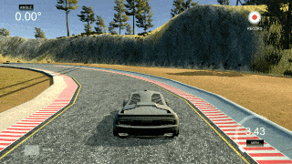 | 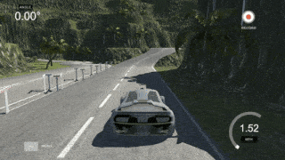 |

The training mode lets the user explore the environment and record its driving data for later training. The autonomous mode lets the developer plug in a flask app with a model that would handle the car controls.

Please refer to this [repository](https://github.com/udacity/self-driving-car-sim) for further details.


### Data collection strategies

Even though the data is simulated, in order to retrieve quality annotated data, a human input is required, which makes data collection time-bounded. To avoid driving hours on the simulator, the environment lets us pick three visual point of views (left, center and right cameras).


Since we only retrieve for each frame the steering angle of the car (which applies to the center camera), in order to use the two other inputs, a small steering correction has to be made as shown above.

After several tests, good results seemed to be obtained using a 0.25° steering correction (+0.25, 0, -025).


### Dataset

The provided dataset includes 8036 samples with 3 different angles of view. Using the steering correction mentioned above, the total usable images of the dataset reaches 24 108 images and steering angles.

|                | Left camera                             | Center camera                               | Right camera                              |
| -------------- | --------------------------------------- | ------------------------------------------- | ----------------------------------------- |
| Original image | 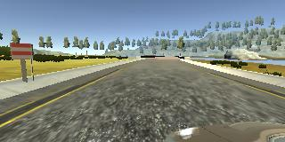 | 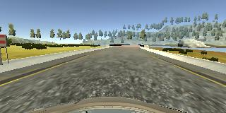 | 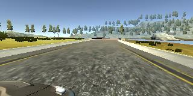 |


#### Dataset distribution


The angle distribution is highly imbalanced as shown above, despite the steering correction trick. This might be a problem during training as the distribution shows that very small steering angles are predominant. 

**54% of samples have a 0° steering angle**. Thus the model will most likely learn on straight line driving, while the trickiest part would be curves.

In order to tackle this, we will simply introduce a probability $p$ of taking 0° steering samples. By experimenting with this parameter during training, the value `p=0.5` was selected.


#### Preprocessing

 The data preprocessing will include:

- cropping: consider only the relevant part in the image (sky and hood parts of the image do not help).
- resizing: high resolution input is not necessarily here.
- augmentation: random horizontal flip, and shadowing will be used to improve generalization.
- normalization: feeding normalized data to the model even on new data distribution *(with the mean and standard deviation of the training set)*. 


|                           | Left camera                                         | Center camera                                           | Right camera                                          |
| ------------------------- | --------------------------------------------------- | ------------------------------------------------------- | ----------------------------------------------------- |
| Original image            |              |              |              |
| Cropped and resized image | 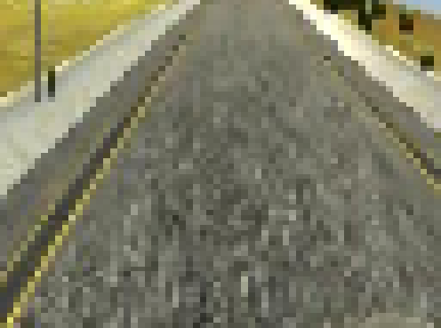 | 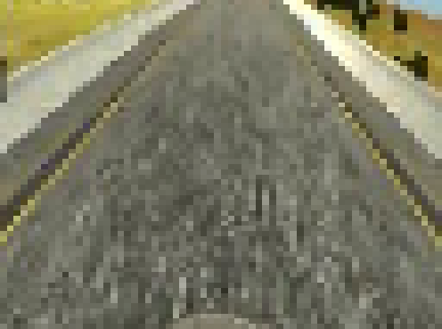 | 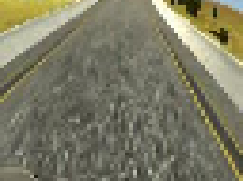 |
| Augmented image           | 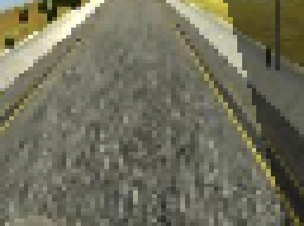 | 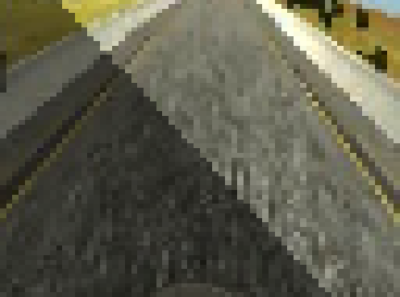 | 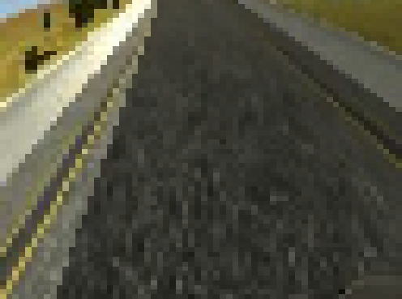 |


### Architecture

For this project, several architectures were explored to end up with a regression model being both light and high performing. Here are the different architectures that were explored:

#### LeNet5

[LeNet5](http://yann.lecun.com/exdb/publis/pdf/lecun-01a.pdf) architecture was designed for simple image classification tasks initially, but here we repurposed it for regression adding dropout to the inputs of hidden fully connected layers. The key differences are that here images are not in grayscale (unlike [MNIST](http://yann.lecun.com/exdb/mnist/)), but the provided dataset shows low graphics / simple visual information. Resizing the input to 64x64 ended up giving encouraging results.


*Source: Gradient-based learning applied to document recognition (1998)*

During training experiments, some issues were noticed: the low number of convolutional layers ends up providing the network with very simple representation of spatial features. Even though the data holds less spatial information than actual pictures, it remains much richer than grayscale digits. During the test run in the simulator, we end up with a non-smooth behavior resulting in the car getting out the track a bit later.

#### DAVE-2 System

As suggested by project instructions, NVIDIA released in 2016 a light architecture to control steering of the self-driving car in near real-time (10 FPS).


Compared to our problem, the input data is much richer spatially and more complex. But it is trained for the same target task. Since the spatial complexity of the input data can be adapted using resizing, this candidate was bearing a lot of hopes in this project.

Without much suspense, it performs quite well after ~15-20 epochs of training. But for the sake of experimentation, we will focus on a custom architecture leveraging the learnings of those two architectures.

#### BabyPilot

Let us start with what we learned from the previous architectures:

- for the steering regression on simulated data, we need to adapt the input data by
  - Cropping: down to the section of the image visually relevant to steering, 
  - Resizing: DAVE-2 was fed with 66x200 pictures, our data being much simpler spatially, it would be beneficial to consider smaller sizes than this.
- Spatial features extraction
  - the number of features required is most likely similar to DAVE-2 as the task is similar, meaning that we can adopt a similar channel expansion strategy in convolutional layers.
  - the complexity of spatial features is lower than with DAVE-2 but higher than MNIST, meaning that we will most likely have a number of convolutional layers between that of DAVE-2 and LeNet5.
- Number of parameters
  - having too big spatial features on your last convolutional layers may cost us a lot in fully connected layers' size, so we will consider using [global average pooling](https://arxiv.org/abs/1312.4400) instead of flattening. Alternatively, we will keep the number of hidden features low to keep the model's size reasonable.


By using the previous observations and assumptions, we implement our final model:


```
Model: "sequential"
_________________________________________________________________
Layer (type)                 Output Shape              Param #   
=================================================================
lambda (Lambda)              (None, 64, 64, 3)         0         
_________________________________________________________________
conv2d (Conv2D)              (None, 62, 62, 16)        448       
_________________________________________________________________
max_pooling2d (MaxPooling2D) (None, 31, 31, 16)        0         
_________________________________________________________________
conv2d_1 (Conv2D)            (None, 29, 29, 32)        4640      
_________________________________________________________________
max_pooling2d_1 (MaxPooling2 (None, 14, 14, 32)        0         
_________________________________________________________________
conv2d_2 (Conv2D)            (None, 12, 12, 64)        18496     
_________________________________________________________________
max_pooling2d_2 (MaxPooling2 (None, 6, 6, 64)          0         
_________________________________________________________________
flatten (Flatten)            (None, 2304)              0         
_________________________________________________________________
dropout (Dropout)            (None, 2304)              0         
_________________________________________________________________
dense (Dense)                (None, 128)               295040    
_________________________________________________________________
dropout_1 (Dropout)          (None, 128)               0         
_________________________________________________________________
dense_1 (Dense)              (None, 64)                8256      
_________________________________________________________________
dropout_2 (Dropout)          (None, 64)                0         
_________________________________________________________________
dense_2 (Dense)              (None, 16)                1040      
_________________________________________________________________
dense_3 (Dense)              (None, 1)                 17        
=================================================================
Total params: 327,937
Trainable params: 327,937
Non-trainable params: 0
```

You will notice that the number of parameters is much lower than the 2.9M of DAVE-2, and that global average pooling was not used here. The reason behind this comes only from a practical perspective, as keras [implementation](https://www.tensorflow.org/api_docs/python/tf/keras/layers/GlobalAveragePooling2D) does not allow other output shapes than 1x1 (it flattens the tensor right away).


### Training sequence

The training sequence is handled by the `train.py` script as follows:

- optimizer: [Adam](https://arxiv.org/abs/1412.6980) *(commonly used for vision tasks)*
- loss: MSE loss *(common loss for regression)*
- batch size: 32 *(selected based on GPU RAM capacity)*
- epochs: 20
- learning rate scheduler: reduce on plateau
- starting learning rate: 5e-4 (to speed up convergence and avoid overfitting)
- Dropout rate: 0.3 *(reduces overfitting without extending the number of epochs too much)*


The training procedure yields very positive results with a final training loss of 0.04394 and validation of 0.04402.

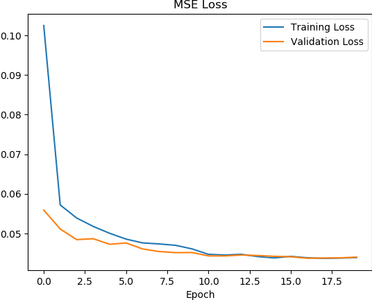

The MSE loss curves show a good generalization capacity of the model, without any apparent overfitting. The model parameters' values were saved [here](https://github.com/frgfm/sdcnd-p4-behavioral-cloning/releases/download/v0.1.0/model.h5).


### Results

The trained [model](https://github.com/frgfm/sdcnd-p4-behavioral-cloning/releases/download/v0.1.0/model.h5) is able to drive around the first track without any issue (Resolution: `800 x 600`, Graphics Quality: `Fastest` ) especially after removing 50% of the 0° steering angle in the training phase.


Full-length lap recordings are available in first-person and third-person view in the release attachments:

- [First Person View](https://github.com/frgfm/sdcnd-p4-behavioral-cloning/releases/download/v0.1.0/autonomous_01_fpv.mp4)
- [Third Person View](https://github.com/frgfm/sdcnd-p4-behavioral-cloning/releases/download/v0.1.0/autonomous_01_tpv.mp4)


## Limitations and improvements

### Limitations

During tests in autonomous mode, a few issues were spotted:

- track overfitting: training the model on one track only makes evaluation hard on a different track. Color augmentation might help.
- track recovery: when putting the car already outside of the track, the model is rarely able to recover even in close proximity.
- graphics overfitting: this one is a very interesting lead for augmentation. For report render purposes, different graphics and resolution were tested with the trained model. While the resolution does not change much (because of resizing), the graphics settings influence a lot the performances.


Since the provided dataset seemed to have been recorded on `Graphics Quality: Fastest`, best performances are obtained when evaluating in the same mode. Apparent failures appear very quickly if you were to use `Graphics Quality: Fanstastic` instead as shown above. Knowing this, while driving the simulator, it would be interesting to record for each cameras the renders in different graphics settings.


### Improvements

A few ideas to explore for next versions:

- **learned task**: the current input is a single frame, using also the past frames could bring interesting results exploring either RNN or 3D convolutions. A different approach could also be taken using reinforcement learning where the action space is the steering angle.
- **data augmentations**: on top of the environment flexibility, domain augmentation could be applied using a GAN approach.
- **transfer learning**: using the model trained on this environment, trying to perform the same task on higher-end graphics game would be an interesting project.
- **normalization**: compute training dataset statistics and use them for normalization for easier convergence.


## Credits

This implementation is vastly based on the following methods:

- [Gradient-based Learning Applied to Document Recognition](http://yann.lecun.com/exdb/publis/pdf/lecun-01a.pdf)
- [Dropout: A Simple Way to Prevent Neural Networks from Overfitting](http://jmlr.org/papers/volume15/srivastava14a/srivastava14a.pdf)
- [Batch Normalization: Accelerating Deep Network Training by Reducing Internal Coveriate Shift](https://arxiv.org/pdf/1502.03167.pdf)
- [End to End Learning for Self-Driving Cars](https://arxiv.org/pdf/1604.07316.pdf)


## License

Distributed under the MIT License. See `LICENSE` for more information.